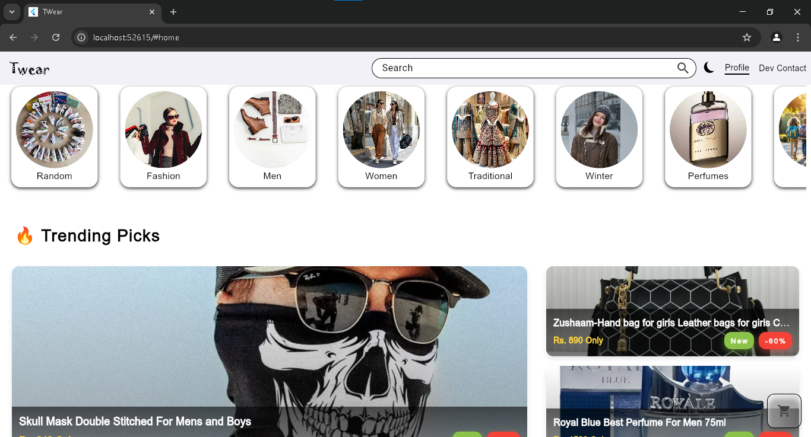

# 🧥 **Twear - Wearables Showcase Simulator**

**Twear** is a fully responsive and interactive wearables showcase simulator built using **Flutter**. This project is a front-end-only demo with all data stored statically within the app, except for images, which are hosted on **Cloudinary**.

### 🌐 **Live Demo**: [twear-web.surge.sh](https://twear-web.surge.sh)
[](twear-web.surge.sh)
---

## 📑 **Features**


- 🖥 **Theme Switch**: One can switch theme based on their preference from **light mode** and **dark mode**.
- 💎 **Product Showcase**: Browse a variety of wearable products with smooth animations.
- 📱 **Responsive Design**: Optimized for desktop, tablet, and mobile views.
- 🚀 **Loading**: This site may **lack fast loading** because it is **developed in flutter** which is **primarily an app development framework**.
- 🧮 **Simulator Only**: No backend; all interactions are simulated with static data.
- 📝 **Products CRUD**: You can **add, update and delete the products products**. 
- 🔑 **Simulated SignIn**
- 📃 **Basic DashBoard**

  

---

## 🚀 **Technologies Used**

- **Framework**: Flutter (Web)
- **Image Hosting**: Cloudinary
- **Deployment**: Surge.sh
- **State Management**: Bloc

---

## 🛠️ **How to Run Locally**

1. **Go to you terminal**:

   
2. **Paste below commands one by one**:
```bash
  git clone https://github.com/haris-315/T-wear
  cd twear
  flutter pub get
  flutter run -d chrome


